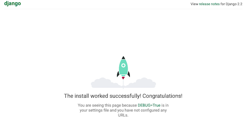

**************
Django inicial
**************

Primeiros Passos
================

Verifique se o Python está instalado e sua versão
-------------------------------------------------

Para ter certeza que tenho Python executo o python pedindo a versão.

.. code-block:: bash

    # no seu shell execute ... o comando abaixo

    $>python -V

... o resultado esperado é  a versão do Python instalada, algo como "Python 3.X.X", onde X é uma variação da versão 3.

O meu computador o resultado é...

    Python 3.7.4

Instalando o Django
-------------------

Instale o Django ...   depois de ter seu Python3 instalado.

.. code-block:: bash

    # no seu shell execute ... o comando abaixo

    $>pip install django

Valide se Django OK

Validando que o Django está instalado e verificamos sua versao ..

.. code-block:: bash

    # no seu shell execute ... o comando abaixo

    $>django-admin --version

A saída esperada é algo como **2.x.x** onde x é uma variação da versão 2.

na minha máquina a saída do comando foi ...

    2.2.6

Inicie um projeto Django
========================

A sintaxe do comando é `django-admin startproject <nome do projeto>`

.. code-block:: bash

    # no seu shell execute ... o comando abaixo

    $>django-admin startproject prjdj

O Django criar um diretório com o nome do projeto (ex.: "prjdj")
vou acessar o diretório do meu projeto Django que acabei de criar com o nome de "prjdj"

.. code-block:: bash

    $>cd /Volumes/p10G/prj/prjdj

Rode o seu projeto django
-------------------------

comando `python manage.py runserver`

.. code-block:: bash

    # no seu shell execute ... o comando abaixo

    $>python manage.py  runserver
    Watching for file changes with StatReloader
    Performing system checks...

    System check identified no issues (0 silenced).

    You have 17 unapplied migration(s). Your project may not work properly until you apply the migrations for app(s): admin, auth, contenttypes, sessions.
    Run 'python manage.py migrate' to apply them.

    October 09, 2019 - 19:20:09
    Django version 2.2.6, using settings 'prjdj.settings'
    Starting development server at http://127.0.0.1:8000/
    Quit the server with CONTROL-C.
    [09/Oct/2019 19:20:18] "GET / HTTP/1.1" 200 16348
    [09/Oct/2019 19:20:18] "GET /static/admin/css/fonts.css HTTP/1.1" 200 423
    [09/Oct/2019 19:20:19] "GET /static/admin/fonts/Roboto-Regular-webfont.woff HTTP/1.1" 200 85876
    [09/Oct/2019 19:20:19] "GET /static/admin/fonts/Roboto-Bold-webfont.woff HTTP/1.1" 200 86184
    [09/Oct/2019 19:20:19] "GET /static/admin/fonts/Roboto-Light-webfont.woff HTTP/1.1" 200 85692

Com o seu navegador Web acesse o endereço  *127.0.0.1:8000*

ex.: http://127.0.0.1:8000  (o mesmo que http://localhost:8000)

No seu navegador você deverá ver uma página como a abaixo.

Entenda a saída do comando `runserver` ...
------------------------------------------

O servidor de desenvolvimento do Django está rodando e você pode editar seu código sem desligá-lo.

Desde que não tenha erros, ele não deve parar ( ... boa sorte!)

    >Watching for file changes with StatReloader

Ao executar seu projeto, o Django identificou que existem migrações para serem executadas no banco de dados ...

    You have 17 unapplied migration(s). Your project may not work properly until you apply the migrations for app(s): admin, auth, contenttypes, sessions.
    Run 'python manage.py migrate' to apply them.

Essa migrações são referentes as aplicações Django "enbutidas" no Django. Uma delas é o **sistema de gestão de usuários**

Seguindo a sugestão do Django, vamos rodar essas migrações para que nosso banco seja criado...

Criando o Banco de dados
------------------------

comando *`python manage.py migrate:wq:`*

    Atenção: se o banco de dados for o POSTGRESQL você deve ANTES criar o banco de dados e depois rodar as migrations - neste caso o Django somente criar as tabelas.

.. code-block:: bash

    # no seu shell execute ... o comando abaixo

    >$python manage.py migrate
    Operations to perform:
    Apply all migrations: admin, auth, contenttypes, sessions
    Running migrations:
    Applying contenttypes.0001_initial... OK
    Applying auth.0001_initial... OK
    Applying admin.0001_initial... OK
    Applying admin.0002_logentry_remove_auto_add... OK
    Applying admin.0003_logentry_add_action_flag_choices... OK
    Applying contenttypes.0002_remove_content_type_name... OK
    Applying auth.0002_alter_permission_name_max_length... OK
    Applying auth.0003_alter_user_email_max_length... OK
    Applying auth.0004_alter_user_username_opts... OK
    Applying auth.0005_alter_user_last_login_null... OK
    Applying auth.0006_require_contenttypes_0002... OK
    Applying auth.0007_alter_validators_add_error_messages... OK
    Applying auth.0008_alter_user_username_max_length... OK
    Applying auth.0009_alter_user_last_name_max_length... OK
    Applying auth.0010_alter_group_name_max_length... OK
    Applying auth.0011_update_proxy_permissions... OK
    Applying sessions.0001_initial... OK

git
---

git init
git remote add origin git@github.com:cadu-leite/prjdj.git
git remote add origin git@github.com:cadu-leite/prjdj.git
git add .
git commit -m "first commit"
git push -u origin master